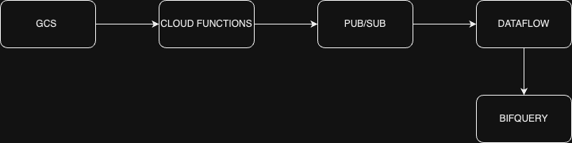

# PUB/SUB STREAMING PROJECT
## Pre-requisites:
-	GCS (Google Cloud Storage): GCS is a robust storage solution offered by Google Cloud. It's designed to store, access, and manage large datasets, ensuring data is safe and accessible globally with high durability and scalability.
-	Cloud Functions: A feature of Google Cloud, Cloud Functions are serverless, event-driven pieces of code. They automatically execute in response to specific events within the cloud environment, eliminating the need for server management.
-	pub/sub (Publish/Subscribe): Google Cloud's Pub/Sub is a real-time messaging service. It facilitates asynchronous communication by allowing systems to publish messages that other systems can then subscribe to, ensuring decoupled and efficient data exchange.
-	Dataflow: Offered by Google Cloud, Dataflow is a data processing service tailored for large-scale analytics. It seamlessly handles both real-time (stream) and historical (batch) data, making it easier to derive insights from vast datasets.
-	BigQuery: BigQuery is a powerful, serverless data warehouse solution in Google Cloud. It's optimized for running complex queries over vast amounts of data in seconds, providing businesses with real-time analytics and insights.
## FLOW DIAGRAM:

## START PROJECT
## STEP 1:
Create a bucket in GCS:
gsutil mb -l LOCATION gs://YOUR_BUCKET_NAME
## STEP 2:
Create a Pub/Sub Topic:
gcloud pubsub topics create [YOUR_TOPIC_NAME]
## STEP 3:
Setup GCS Notification:
gsutil notification create -t [YOUR_TOPIC_NAME]-f json gs:// YOUR_BUCKET_NAME
To check notifications:
gsutil notification list gs:// YOUR_BUCKET_NAME
## STEP 4:
Create a Cloud function:
-	Navigate to the Cloud Functions section in the Google Cloud Console.
-	Click "Create Function".
-	Name your function and set the trigger type to "Cloud Storage" and select the event type.
-	Navigate to function code
-   Set Runtime to Python.
-   Use <mark> main.py </mark> file.
-   Use <mark>requirements.txt</mark> file.
-   Change the entry point to function name (stream_gcs_to_pubsub).
## STEP 5:
Create an empty Table in BigQuery with respective schema.
bq mk --table --schema field1:STRING,field2:INT64 your_dataset.your_table_name

## STEP 6:
Create a Dataflow Template:
-	Navigate to Create Job from Template.
-	Give Job Name.
-	For Template select Pub/Sub Topic to BigQuery.
-	Fill the required columns and Run the Job.
## STEP 7:
-   Upload the employees.json(sample) file in GCS Bucket.
-   Employee records table should be in BigQuery if all goes according to plan.
